<h1 align="center">StockX Price Premium Preditive Analysis
</h1>

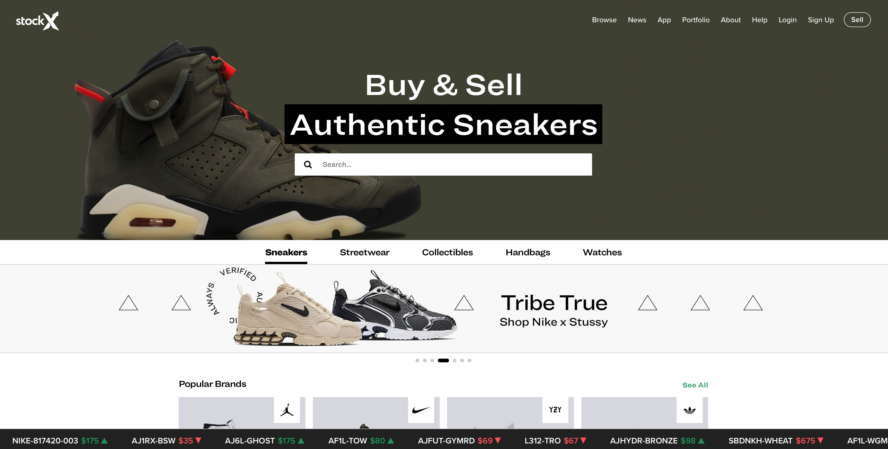

<h4 align="center">Use Machine Learning to learn undervalued sneakers.</h4>

​                                                        [](http://badges.mit-license.org)[](https://pypi.python.org/pypi/yt2mp3/)


## PROJECT OVERVIEW

- **ABSTRACT**: This project aims to investigate the features behind resale premiums on [StockX](https://stockx.com/sneakers) and their prediction power by conduct feature engineering and utilize external popularity index on different brands

- **ASSUMPTION**: Hot sneakers presents little seaonalities, and in this project we will not discuss time series analysis.
- **DATA**: [StockX Data Challenge 2019](https://s3.amazonaws.com/stockx-sneaker-analysis/wp-content/uploads/2019/02/StockX-Data-Contest-2019-3.xlsx); Demographic Data 2020
- **MODEL**: Tree-based and Linear Regression

|  Tree-based   |       Linear       |
| :-----------: | :----------------: |
| Random Forest |       Lasso        |
|    XGboost    | SVM(Linear Kernel) |

- **RESULT:** We have utilized our strategy and identified undervalued shoes through March 2020, and these shoes have increased their price within 80% of our prediction by the end of March 2020.

  *Out-of-Sample Results:*

|                      Sneaker Name                       |                            Image                             | Retail | Most Recent Sale | Current Premium | Predicted Premium |
| :-----------------------------------------------------: | :----------------------------------------------------------: | :----: | :--------------: | :-------------: | :---------------: |
| **Air Jordan** 1 Retro High Travis Scott(**Tan/Brown**) |  |  $175  |   $797 - $1486   |     497.4%      |    **802.0%**     |
|      **Blazer** Mid 77 Vintage Slam Jam(**White**)      |  |  $100  |   $470 - $486    |     381.0%      |    **455.5%**     |
|   **Yeezy** Boost 350 V2 Tail Light(**Grey, Orange**)   |  |  $220  |   $289 - $336    |      31.8%      |     **82.0%**     |

 																										(*The price data below is based on March 2020)

## Table of Contents

* [Motivation](#motivation)
* [Data Source](#data-source)
* [Exploratory Data Analysis](#exploratory-data-analysis)
  * [Anomaly Dectection](#anomaly-detection)
  * [Time Feature](#time-feature)
  * [Color Feature](#color-feature)
  * [Region Feature](#region-feature)
* [Modeling](#modeling)
  - [Feature Engineering](#feature-engineering)
  - [Model Selection](#model-selection)
  - [Result](#result)
* [Prediction Result](#prediction-result)
* [Limitation](#limitation)
* [Improvement](#improvement)
* [Contributer](#contributer)

## Motivation


The above is the famous Red Nike Yeezy. Its retail price is $250, and the latest resale price is $6,200, marked up by nearly 2400%. The high resale premium of this pair is not a single event. The once niche market of sneaker resale has grown to become a $2 billion market, and it is projected to reach $6 billion by 2025. Within the sneaker resale market, StockX is one of the largest platforms. The website operates like a stock exchange, where users can place a bidding or asking prices, and a deal is made whenever there’s a match. What is so valuable for us is that the platform offers transparent and actionable data. Using such data, we want to build a predictive model to identify undervalued sneakers, which resellers can invest in now and sell at higher price later.

## Data Source

We utilized public data offered through the [StockX Data Contest](https://stockx.com/news/the-2019-data-contest/), which consists of 99,956 transactions from 2017 to 2019. The dataset consists of two brands -- Yeezy and Nike Off-White, and over 50 different styles. 

To expand upon the features, we also manually obtained the colorway and number of sales from the StockX website. We then converted style and color into dummy variables, and sneaker size into frequency encoding as common shoe sizes are sold at higher premium. For modeling purposes, our target variable is price premium, which equals price markup over retail price, and our input variables are days since release, style, colorway, size, and number of sales.

Table: Initial Data Preprosessing

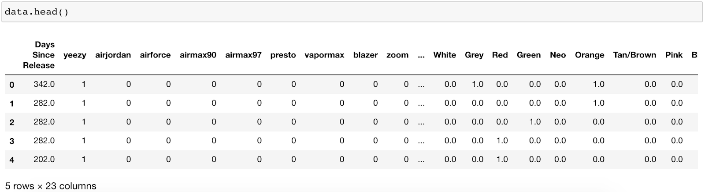

## Exploratory Data Analysis

Looking at price premium, we could easily observe that it is heavily skewed to the right. Most resale transactions were marked up between 0% to 500%, yet there are some extreme transactions whose markups were over 2000%. As such, we would first conduct anomaly detection to examine those points on the very high end and find common features among them.

 

### Anomaly Detection

Since the target variable is non-negative and heavily right skewed, we would take the logrithm to have more robust results in outlier detection.

- **Step 1** Train an isolation forest on target value and use decision rules to find outliers.

~~~python
model=IsolationForest(n_estimators=100, max_samples='auto', contamination= 0.05 ,max_features=1.0)
model.fit(y[['Pct_change']])
y['scores']=model.decision_function(y[['Pct_change']])
y['anomaly']=model.predict(y[['Pct_change']])

#IsolationForest(behaviour='deprecated', bootstrap=False, contamination=0.05,
#                max_features=1.0, max_samples='auto', n_estimators=100,
#                n_jobs=None, random_state=None, verbose=0, warm_start=False)
~~~

- **Step 2** Create anomaly lists and compare it to non-anomaly points

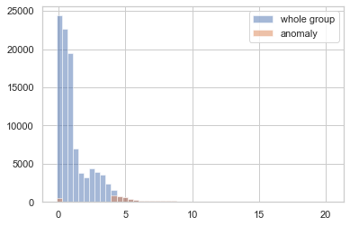 

| Metric | whole | normal | Anamoly |
| :----: | :---: | :----: | :-----: |
|  Mean  | 1.25  |  1.03  |  5.40   |
| Median | 0.70  |  0.68  |  5.00   |

Most anomaly points lie on the right tail of the distribution, and their cut-off (using median statistics) is approximately exp(5). This indicates that our data becomes noiser at higher price premiums. As such, we would next group these anomly points by brand, by color, and by region to get some further insights of our dataset.

- **Step 3** Explore anomaly points

**Style** The top three styles that saw extreme resale prices are Air Jordan, Presto, and Blazer. Note that these are all Nike sneakers. Among them, Air Jordan saw the highest price premium of over 2000%. Yeezy sneakers followed at the fourth place.

**Color** White is the dominating color feature. There are two hypothesis on why its resale prices are high: 

1. Most sneakers are white; 
2. White is indeed a significant feature. 

To test our hypothesis, we will further examine which specific sneakers contributed the most. 

**Region** California and New York overall saw the highest price premium. However, this doesn't mean these two states have the highest per capita premium. Stay around for further analysis in per capital level.

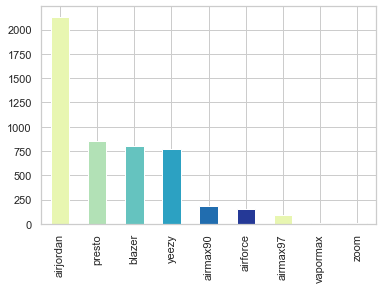 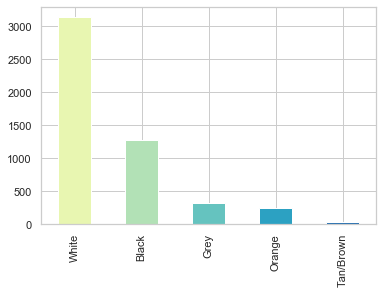 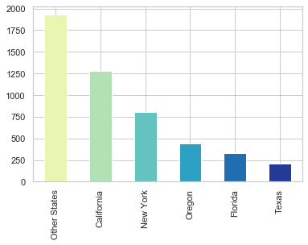 

### Time Feature

 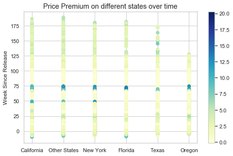 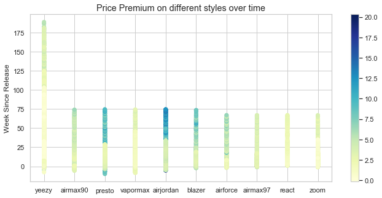 

- **Time effect on Nike**

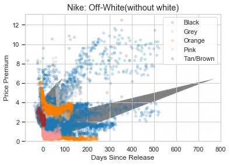

- **Top 3 nike brands**

 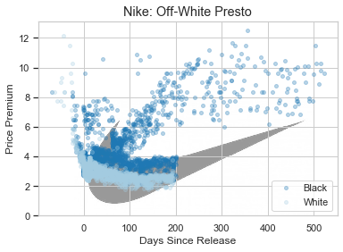 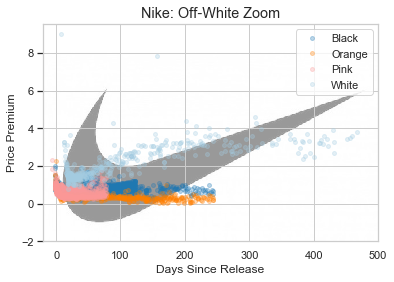 

- **Time effect on Yeezy**

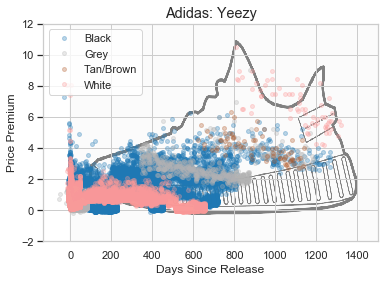

Statistically, the best time to sell in the secondary market is 3 to 5 weeks before the release date. The worst time to sell is the first 9 weeks after release, when the market is saturated. After that, as the availability in market declines, buyers are generally willing to pay higher premiums. 

### Color Feature

Our dataset consists of two major brands – yeezy and nike off-white. In terms of yeezy, we could see that basic colors including black, white, and grey have constant growth. Bolder colors like orange would start high but decline as time passes. In terms of off-white, red is the most popular color.

### Region Feature

Looking at the number of sales, California ranks the first and Oregon ranks the third. However, when we look at the percentage of population that purchases from StockX, Oregon comes to the top with nearly 2 transactions per 1000 people. Hence, StockX might want to make more promotions in Oregon, but keep in mind that as a reseller, we cannot control the sales region.

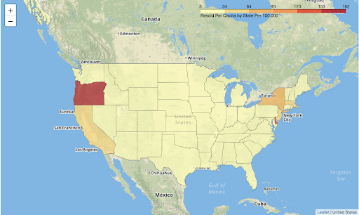

## Modeling 

### Feature Engineering

To recapture the features in our datasets, the target variable is the price premium, calculated as the percentage change of sale price over retail price, and input features are days since release, brand, region, colorway and number of sales, adding up to 31 variables.

### Model Selection

In our project, we tried two types of machine learning models, linear and tree-based regressions. We carefully accessed the performance of each model using 5-fold cross validation:

1. we used the same train-test split and the same seed for cross validation
2. we used the GridSearchCV package to implement all models
3. we used R2 as our evaluation metric

- **Linear Model - Lasso**

According to our Exploratory Data Analysis, certain styles and colors (i.e. white) have over emphasizing power. In consideration of outliers and overfitting issues, we utilized the Lasso model to ensure regularization.

  $$
  \sum_{i=1}^{n}\left(y_{i}-\widehat{y}_{i}\right)^{2} + \lambda \quad \times \sum_{i}^{p}\left|\beta_{j}\right|
  $$
  
To choose the optimal shrinkage parameter, we used cross validation. The optimal shrinkage coefficient is $10^{-6}$


  ```python
  lasso = Lasso()
  parameters = {'alpha': [1e-5,1e-4,1e-3,1e-2,1e-1,1e0,1e1,1e2,1e3,1e4,1e5]}
  r2 = make_scorer(r2_score, greater_is_better=True)
  clf = GridSearchCV(lasso, 
                     parameters, 
                     cv=5,
                     scoring=r2)
  ```

- **Linear Model - SVM**

  ```python
  x.train = preprocessing.scale(x_train)
  linearsvr = LinearSVR(tol=0.01)
  parameters = {'C': [0.01, 0.1, 1, 10, 100]} 
  r2 = make_scorer(r2_score, greater_is_better=True)
  clf = GridSearchCV(linearsvr, 
                     parameters, 
                     cv=5, 
                     scoring=r2)
  ```

- **Tree-based - XGBoost**

  ```python
  params = {'colsample_bytree': [i/10. for i in range(8,11)],
            'subsample': [i/10. for i in range(8,11)],
            'eta': [.3, .4, .5],
            'max_depth': list(range(3,6)),
            'min_child_weight': list(range(4,7)),
            'eval_metric': ['rmse'],
            'objective': ['reg:squarederror']}
  xg_reg = xgb.XGBRegressor()
  r2 = make_scorer(r2_score, greater_is_better=True)
  clf = GridSearchCV(xg_reg, 
                     params, 
                     cv=5, 
                     scoring=r2)
  ```

  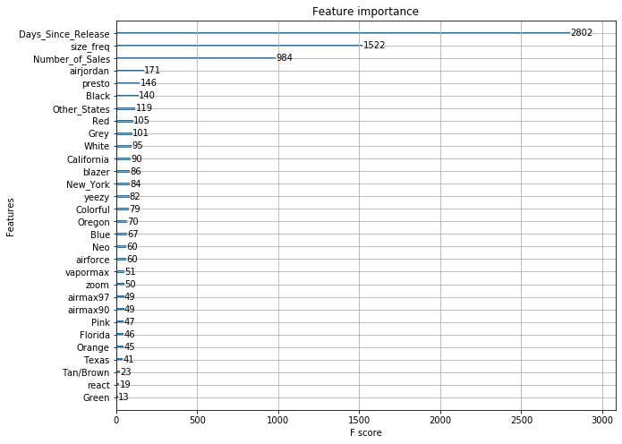
  
  


#### Model Summary

|                   Model                    |                  r2 score                  | MSE                                      | Features                                                     |
| :----------------------------------------: | :----------------------------------------: | ---------------------------------------- | ------------------------------------------------------------ |
| <span style="color:blue">**Lasso** </span> | <span style="color:blue">**0.7810**</span> | <span style="color:blue">**0.51**</span> | <span style="color:blue">**`Days_Since_Release`:(+); `yeezy`: (-) `airjordan` :(+)**</span> |
|                    SVM                     |                   0.7508                   | 0.39                                     | /                                                            |
|                  XGBoost                   |                   0.9671                   | 0.04                                     | `Days_Since_Release`; `size_freq`; `Number_of_Sales`         |


According to our modeling results, XGBoost has the highest R2. However, the XGBoost model is considered overfitted given that we have 31 features and less than 100,000 data points. The Lasso and SVM models are comparable in terms of the three models have comparable result.### 这里 1）我觉得model feature的那一栏不需要 2) 还需要说明tree model overfit了

  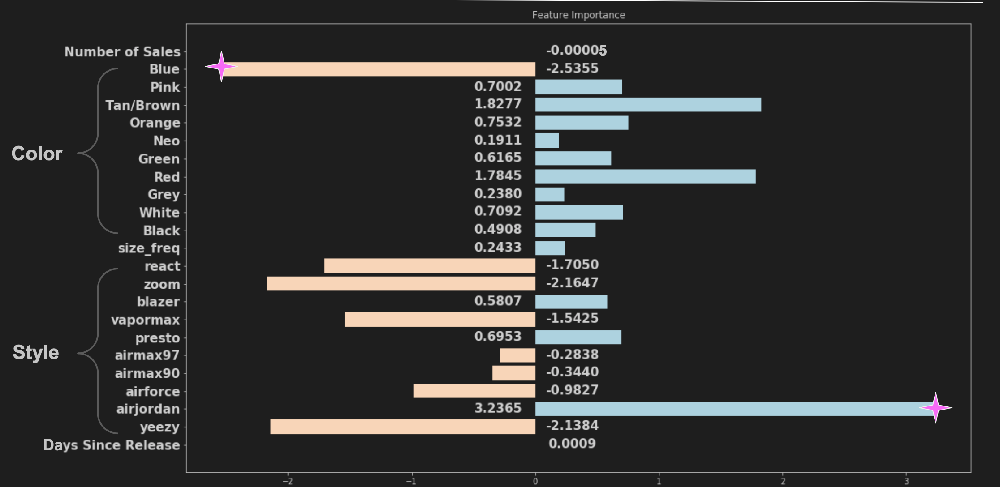

The Lasso coefficients are as above. Orange blocks represents negative coefficients, and blues represents positive coefficients. In terms of styles, AirJordan is the most lucrative, with an additional price premium of 324%. In terms of colors, red and tan will boost price premium, while blue seems to hurt resale prices. Further, as the number of sales increase, the price premium will go down. This could be explained by the value of scarcity (这句话什么意思啊???）.

## Prediction Result

According to our prediction model, sneakers of certain styles (i.e. AirJordan 1 and blazer) and of certain colors (i.e.red and tan) are the most investable. Based on this knowledge, we tried to find some undervalued sneakers, which we can invest in now  and sell higher later. We listed some proposed candidates below. 

The first pair listed is Air Jordan 1 by Travis Scott, released in May, 2019. If you are a sneakerhead, you probably already know that this is a popular pair. The question is, given the current resale price, could the price go up even higher. The answer is YES! This pair is selling at 500% markup as of early April, while our model predicts that the markup should have been 800%. As such, there is an arbitrage opportunity here, which would turn into a profit of over $500 on a single pair. The other candidates would follow similarly.


|               Sneaker(predicted on 03/26/2020)               | Feature                                                      |                            Image                             |
| :----------------------------------------------------------: | :----------------------------------------------------------- | :----------------------------------------------------------: |
| [Air Jordan 1 Retro High Travis Scott](https://stockx.com/air-jordan-1-retro-high-travis-scott) | <font size="2"> **Feature:** air-jordan(3.24)<br/> Tan/Brown(1.83) <br/>**Current Price Premium: 497.4%** <br/>**Predicted Price Premium: 802.0%**</font> |  |
| [Blazer Mid 77 Vintage Slam Jam](https://stockx.com/nike-blazer-mid-77-vintage-white-black) | <font size = "2">**Features: **blazer(0.58), White(0.71)<br>**Current Price Premium: 381.0%**<br>**Predicted Price Premium: 455.5%**</font> |  |
| [Yeezy Boost 350 V2 Tail Light](https://stockx.com/adidas-yeezy-boost-350-v2-tail-light) | <font size = "2">**Features:** blazer(0.58), White(0.71)<br>**Current Price Premium: 381.0%**<br>**Predicted Price Premium: 455.5%**</font> |  |

## Limitation

**1. Time Limitation** The data we utilized only cover sales from 2017 to 2019. Due to the changing tendency of the sneaker resale market, the model’s predictive power might be less stable in far futures.

**2. Brand Limitation** Since our data only covers two major brands -- Yeezy and Nike Off-White, it might not be appropriate to generalize our predictive model to other brands of sneakers.

## Further Improvement

1. Time Series consideration, 
2. DNN Model

## Contributer

