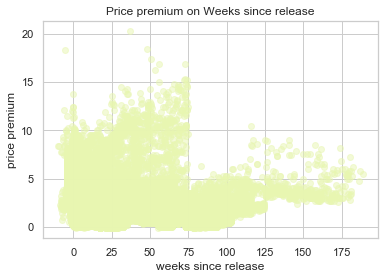
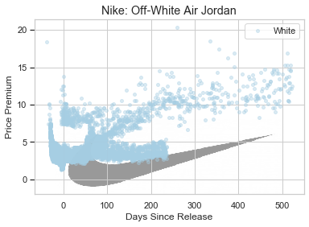

<h1 align="center">StockX Price Premium Preditive Analysis
</h1>


<h4 align="center">Use Machine Learning to learn undervalued sneakers.</h4>

​                                                        [](http://badges.mit-license.org)[](https://pypi.python.org/pypi/yt2mp3/)


## PROJECT OVERVIEW

- **ABSTRACT**: This project aims to investigate the features behind resale premiums on [StockX](https://stockx.com/sneakers) and their prediction power by conduct feature engineering and utilize external popularity index on different brands

- **ASSUMPTION**: Hot sneakers presents little seaonalities, and in this project we will not discuss time series analysis.
- **DATA**: [StockX Data Challenge 2019](https://s3.amazonaws.com/stockx-sneaker-analysis/wp-content/uploads/2019/02/StockX-Data-Contest-2019-3.xlsx); Demographic Data 2020
- **MODEL**: Tree-based and Linear Regression

|  Tree-based   |       Linear       |
| :-----------: | :----------------: |
| Random Forest |       Lasso        |
|    XGboost    | SVM(Linear Kernel) |

- **RESULT:** We have utilized our strategy and identified undervalued shoes through March 2020, and these shoes have increased their price within 80% of our prediction by the end of March 2020.

  *Out-of-Sample Results:*

|                      Sneaker Name                       |                            Image                             | Retail | Most Recent Sale | Current Premium | Predicted Premium |
| :-----------------------------------------------------: | :----------------------------------------------------------: | :----: | :--------------: | :-------------: | :---------------: |
| **Air Jordan** 1 Retro High Travis Scott(**Tan/Brown**) |  |  $175  |   $797 - $1486   |     497.4%      |    **802.0%**     |
|      **Blazer** Mid 77 Vintage Slam Jam(**White**)      |  |  $100  |   $470 - $486    |     381.0%      |    **455.5%**     |
|   **Yeezy** Boost 350 V2 Tail Light(**Grey, Orange**)   |  |  $220  |   $289 - $336    |      31.8%      |     **82.0%**     |

 																										(*The price data below is based on March 2020)

## Table of Contents

* [Motivation](#motivation)
* [Data Source](#data-source)
* [Exploratory Data Analysis](#exploratory-data-analysis)
  * [Anomaly Dectection](#anomaly-detection)
  * [Time Feature](#time-feature)
  * [Color Feature](#color-feature)
  * [Region Feature](#region-feature)
* [Modeling](#modeling)
  - [Feature Engineering](#feature-engineering)
  - [Model Selection](model-selection)
  - [Result](result)
* [Prediction Result](prediction_result)
* [Limitation](#limitation)
* [Improvement](improvement)
* [Contributer](#contributer)

## Motivation


The above is the famous Red Nike Yeezy. Its retail price is $250, and the latest resale price is $6,200, marked up by nearly 2400%. The high resale premium of this pair is not a single event. The once niche market of sneaker resale has grown to become a $2 billion market, and it is projected to reach $6 billion by 2025. Within the sneaker resale market, StockX is one of the largest platforms. The website operates like a stock exchange, where users can place a bidding or asking prices, and a deal is made whenever there’s a match. What is so valuable for us is that the platform offers transparent and actionable data. Using such data, we want to build a predictive model to identify undervalued sneakers, which resellers can invest in now and sell at higher price later.

## Data Source

We utilized public data offered through the [StockX Data Contest](https://stockx.com/news/the-2019-data-contest/), which consists of 99,956 transactions from 2017 to 2019. The dataset consists of two brands -- Yeezy and Nike Off-White, and over 50 different styles. 

To expand upon the features, we also manually obtained the colorway and number of sales from the StockX website. We then converted style and color into dummy variables, and sneaker size into frequency encoding as common shoe sizes are sold at higher premium. For modeling purposes, our target variable is price premium, which equals price markup over retail price, and our input variables are days since release, style, colorway, size, and number of sales.
Initial Data Preprosessing:


## Exploratory Data Analysis

Exploring the price premium in our dataset, we found the it's heavily skew to the right, and it condensed in the range(0,3), indicating most sales achieve 4 times transaction price over its original retail one. Notably, there are huge amounts of transactions happen in range beyond 5, heading over 20 times premium. Though some of them are within the reasonable curve, and we would first conduct anomaly detection to discover those anomaly points and found out common features among those outliers.

 

### Anomaly Detection

Since target value is heavily right skewed and positive, taking logrithms would have more robust result in outlier detection.

- **Step 1** Train an isolation forest on target value, using decision rules to find out those outliers.

~~~python
model=IsolationForest(n_estimators=100, max_samples='auto', contamination= 0.05 ,max_features=1.0)
model.fit(y[['Pct_change']])
y['scores']=model.decision_function(y[['Pct_change']])
y['anomaly']=model.predict(y[['Pct_change']])

#IsolationForest(behaviour='deprecated', bootstrap=False, contamination=0.05,
#                max_features=1.0, max_samples='auto', n_estimators=100,
#                n_jobs=None, random_state=None, verbose=0, warm_start=False)
~~~

- **Step 2** Create anomaly lists and compare it to non-anomaly points

 

| Metric | whole | normal | Anamoly |
| :----: | :---: | :----: | :-----: |
|  Mean  | 1.25  |  1.03  |  5.40   |
| Median | 0.70  |  0.68  |  5.00   |


Most Anomaly points lie on the right tail of distribution, and their cut-off(using median statistics) is approximately exp(5), this is a cruicial indicator that if our prediction is beyond 100 times premium, there is large probability the point is an outlier and some statistically important features are underneath the pair of shoe. 

Group anomaly points on their three features: brand, color and region, we could peek into what features are heavily weighted in our dataset.

- **Step 3** Explore anomaly points

**Brand** Air Jordan contributes highest number of price premium among other brands, the anomaly amount has been more than twice larger than the second highest. The top 3 brands, i.e. Air Jordan, Presto, Blazer are all Nike and following these three are the Yeezy brand.

**Color** White color is the dominating color feature. There are two hypothesis on why the number is high: 

1. Most sneakers are white; 2. White is indeed a significant feature. To test our hypothesis, we will further find out which specific sneakers contribute. 

**Region** Other than unnamed states, California and New York has highest state price premium. However, this doesn't mean these two states are have per capita premium. Stay around for further analysis in per capital level.

   

### Time Feature

   

- **Time effect on Nike**


- **Top 3 nike brands**

   

- **Time effect on Yeezy**


Statistically, the best time to resell is 3 to 5 weeks before the release date 0. The worst time to resell is the first 9 weeks after release, when the market is saturated. After that, as the availability in market declines, buyers are willing to pay higher premiums. 

### Color Feature

Our dataset consists of two major brands – yeezy and nike off-white. In terms of yeezy, we can see that basic colors including black, white, and grey have constant growth. Bolder colors like orange would start high but decline as time passes. In terms of off-shite, red is the most popular color.

### Region Feature

Looking at the number of sales, California ranks the first and Oregon ranks the third. However, when we look at the percentage of population that purchases from StockX, Oregon comes to the top with nearly 2 transactions per 1000 people. This means that StockX might want to make more promotions in Oregon, but keep in mind that as a reseller, we cannot control the sales region.


## Modeling 

### Feature Engineering

To recapture the features in our datasets, the target variable is the price premium, calculated as the percentage change of sale price over retail price, and input features are days since release, brand, region, colorway and number of sales, adding up to 31 variables.

### Model Selection

In our project, we’ve tried 2 types of machine learning models, linear and tree-based regression ones. Due to different implementation and library on these algorithms, we've consolidate our model 

1. the same data train-test split and 5-fold validation fold (same random seed)
2. the same implemtation package GridSearchCV
3. using r2 as our evaluation metric

- **Linear Model - Lasso**

  We see from the Exploratory Data Analysis step, some brands or some colors (e.x. white) have over emphasizing power. In consideration of outliers and overfitting issues, we utilize Lasso model  to ensure regularization.
  $$
  \sum_{i=1}^{n}\left(y_{i}-\widehat{y}_{i}\right)^{2} + \lambda \quad \times \sum_{i}^{p}\left|\beta_{j}\right|
  $$

  ```python
  lasso = Lasso()
  parameters = {'alpha': [1e-5,1e-4,1e-3,1e-2,1e-1,1e0,1e1,1e2,1e3,1e4,1e5]}
  r2 = make_scorer(r2_score, greater_is_better=True)
  clf = GridSearchCV(lasso, 
                     parameters, 
                     cv=5,
                     scoring=r2)
  ```

  To choose the optimal penalizing parameter, we used cross validation, and the optimal shrinkage coefficient is $10^{-6}$

  


The coefficients from Lasso are as above. On the left hand side, From the perspective of brand, compared to yeezy, air force, airmac, zoom, and react, Air Jordan indicates an estimated 324% price premium. On the right hand side, from the perspective of color, compared to other color, color blue will reduce/damage the price premium by 253%.Furthermore, as the number of sales increase, the price premium will goes down. This could be explained by the value of scarcity.From this result, we could learn that a brown color shoes has more investing value than a blue shoes. Similarly, reseller should buy Air-Jordan instead of yeezy as early as possible in order to have higher price premium in the future. 

- **Linear Model - SVM**

  ```python
  x.train = preprocessing.scale(x_train)
  linearsvr = LinearSVR(tol=0.01)
  parameters = {'C': [0.01, 0.1, 1, 10, 100]} 
  r2 = make_scorer(r2_score, greater_is_better=True)
  clf = GridSearchCV(linearsvr, 
                     parameters, 
                     cv=5, 
                     scoring=r2)
  ```


- **Tree-based - XGBoost**

  ```python
  params = {'colsample_bytree': [i/10. for i in range(8,11)],
            'subsample': [i/10. for i in range(8,11)],
            'eta': [.3, .4, .5],
            'max_depth': list(range(3,6)),
            'min_child_weight': list(range(4,7)),
            'eval_metric': ['rmse'],
            'objective': ['reg:squarederror']}
  xg_reg = xgb.XGBRegressor()
  r2 = make_scorer(r2_score, greater_is_better=True)
  clf = GridSearchCV(xg_reg, 
                     params, 
                     cv=5, 
                     scoring=r2)
  ```

  
  
  


#### Model Summary

|                   Model                    |                  r2 score                  | MSE                                      | Features                                                     |
| :----------------------------------------: | :----------------------------------------: | ---------------------------------------- | ------------------------------------------------------------ |
| <span style="color:blue">**Lasso** </span> | <span style="color:blue">**0.7810**</span> | <span style="color:blue">**0.51**</span> | <span style="color:blue">**`Days_Since_Release`:(+); `yeezy`: (-) `airjordan` :(+)**</span> |
|                    SVM                     |                   0.7508                   | 0.39                                     | /                                                            |
|                  XGBoost                   |                   0.9671                   | 0.04                                     | `Days_Since_Release`; `size_freq`; `Number_of_Sales`         |


## Prediction Result

Lasso is the winner in the model selection part

According to our prediction model, we already know that sneakers of certain styles, especially Airjordan1 or blazer, and of certain colors, especially red, tan, or orange, are the most investable. Based on this knowledge, we tried to find some undervalued sneakers to see if we can invest on them and make a profit. Here are some proposed candidates that were released fairly recently. Air Jordan 1 by Travis Scott: Well, if you are a sneakerhead, you should already know this one is hot. The question is, is there more room for its price to go up, given that current sale price has been as high as almost 5 times the original retail price. The answer is Yes! Based on our model, the price premium should have been 800%, while it is only 500% as of now. So there is an arbitrage opportunity to cop this pair now and sell higher later. The other candidates would follow similarly.

|               Sneaker(predicted on 03/26/2020)               | Feature                                                      |                            Image                             |
| :----------------------------------------------------------: | :----------------------------------------------------------- | :----------------------------------------------------------: |
| [Air Jordan 1 Retro High Travis Scott](https://stockx.com/air-jordan-1-retro-high-travis-scott) | <font size="2"> **Feature:** air-jordan(3.24)<br/> Tan/Brown(1.83) <br/>**Current Price Premium: 497.4%** <br/>**Predicted Price Premium: 802.0%**</font> |  |
| [Blazer Mid 77 Vintage Slam Jam](https://stockx.com/nike-blazer-mid-77-vintage-white-black) | <font size = "2">**Features: **blazer(0.58), White(0.71)<br>**Current Price Premium: 381.0%**<br>**Predicted Price Premium: 455.5%**</font> |  |
| [Yeezy Boost 350 V2 Tail Light](https://stockx.com/adidas-yeezy-boost-350-v2-tail-light) | <font size = "2">**Features:** blazer(0.58), White(0.71)<br>**Current Price Premium: 381.0%**<br>**Predicted Price Premium: 455.5%**</font> |  |

## Limitation

**1. Brand Generalisation** The data we utilized only cover sales from 2017 to 2019. Due to the changing tendency of the shoe market, this model’s accuracy and predictability for future price premium might be less stable.(added) 

**2. Timing Data Limitation** More other brands’ data and recent sales data could improve the generalization and future predictability of this model. Furthermore, More features data, such as the material or color purity of shoes, could be used to improve our model.

## Improvement

1. Time Series consideration, 
2. DNN Model

## Contributer

